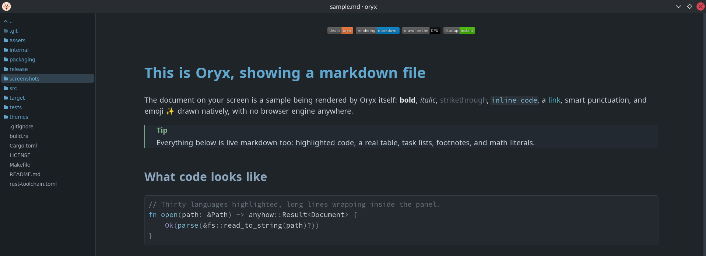
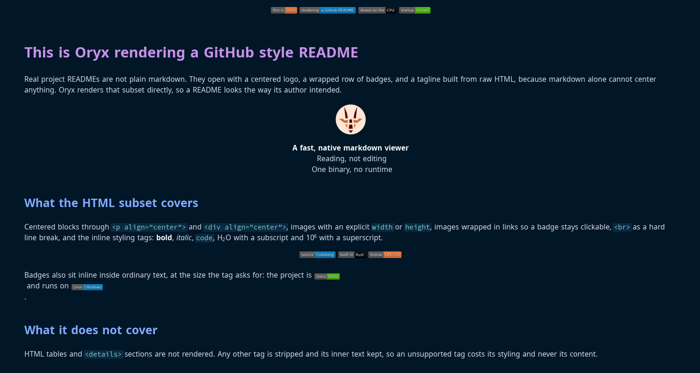
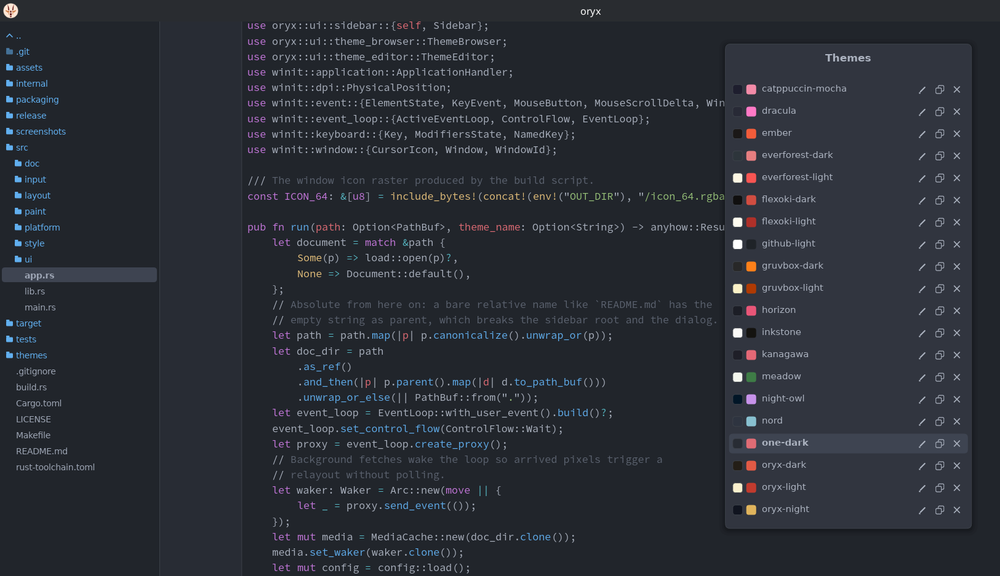
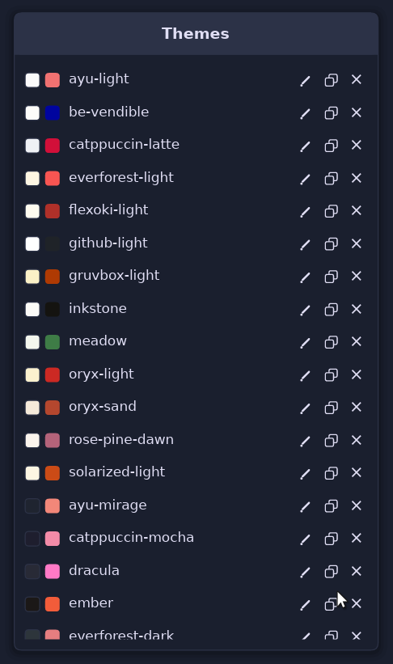
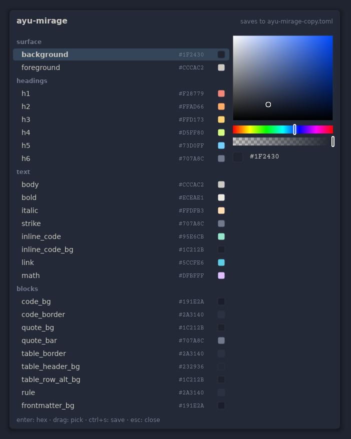

# Oryx

The fastest, most beautiful markdown viewer on the planet.


Oryx started as a personal need: reading a markdown file should not require opening an editor, a browser tab, or an Electron app. Most tools either edit with a preview attached or embed a web engine to draw text. I read a lot of markdown and rarely edit it, so I wanted speed and convenience alone. Oryx renders markdown natively, in a single small binary that draws everything itself on the CPU, with the typography and theming a reader deserves and nothing else on screen.



## Contents

- [Features](#features)
- [Themes](#themes)
- [Installation](#installation)
- [Usage](#usage)
- [Design](#design)
- [What Oryx does not do](#what-oryx-does-not-do)
- [Fonts](#fonts)
- [Contributing](#contributing)
- [How Oryx was built](#how-oryx-was-built)
- [License](#license)

## Features

**Rendering.** Headings, bold, italic, strikethrough, inline code, links, autolinks, and smart punctuation. Syntax highlighted code blocks in thirty languages, with long lines wrapped inside the panel instead of spilling out of it. Tables with striped rows, blockquotes with nesting, GitHub alerts (note, tip, important, warning, caution) with colored bars and titles, task lists, horizontal rules, YAML frontmatter as a metadata panel, and emoji shortcodes like `:tada:`.

**Images and badges.** Local raster and SVG images, plus remote images fetched in the background and cached on disk, so a document full of shields.io badges renders instantly on the second open, even offline.

**GitHub READMEs.** The embedded HTML subset real READMEs use: centered blocks, sized images, clickable badge rows, line breaks, and inline styling tags including sub and sup. A typical project README renders the way its author intended.



**Footnotes and math.** Footnote references render superscript and click-jump to their definitions, collected at the end under a rule. Math literals render styled, with TeX commands like `\sum` and `\alpha` shown as real symbols and simple scripts raised and lowered.

**Find in document.** Ctrl+F opens a floating search bar. Matches highlight as you type, in colors the active theme chooses, and Enter or F3 walks through them with a wrapping counter. Matching is smart case: an all-lowercase query matches any case, a capital letter makes it exact.

**Code files too.** Oryx opens source files directly as a single highlighted document, plus plain text. The folder sidebar makes it a quick reader for any project directory.



**Interface.** A folder sidebar with keyboard navigation, a native open dialog, text selection with copy as plain text or as the original markdown, session zoom, reload from disk for files being edited in parallel, and a shortcuts help screen. The window reopens as you left it: size, position, and maximized state persist across sessions. Every panel is keyboard driven and mouse friendly.

## Themes

Thirty themes ship with Oryx. A theme is one TOML file with 51 color roles covering every element independently; a missing key falls back to a default and a malformed file is skipped, never fatal. The built-in browser (Ctrl+T) previews and applies them live, and the built-in editor changes any role with a color picker while the document restyles behind it. Editing a bundled theme automatically edits a copy, so the shipped files stay pristine.





Eight themes are original designs: `oryx-light` and `oryx-dark` (the default warm identity), `oryx-sand` and `oryx-night`, `inkstone`, `ember`, `meadow`, and `slate`. The rest adapt permissively licensed editor palettes, all MIT, with thanks to their authors:

- Dracula ([draculatheme.com](https://draculatheme.com))
- Nord ([nordtheme.com](https://www.nordtheme.com))
- Gruvbox dark and light ([morhetz/gruvbox](https://github.com/morhetz/gruvbox))
- Catppuccin Mocha and Latte ([catppuccin.com](https://catppuccin.com))
- Tokyo Night ([enkia/tokyo-night-vscode-theme](https://github.com/enkia/tokyo-night-vscode-theme))
- Solarized dark and light by Ethan Schoonover ([ethanschoonover.com/solarized](https://ethanschoonover.com/solarized))
- One Dark ([atom](https://github.com/atom/atom))
- Everforest dark and light ([sainnhe/everforest](https://github.com/sainnhe/everforest))
- Rosé Pine and Rosé Pine Dawn ([rosepinetheme.com](https://rosepinetheme.com))
- Kanagawa ([rebelot/kanagawa.nvim](https://github.com/rebelot/kanagawa.nvim))
- Ayu Mirage and Light ([ayu-theme](https://github.com/ayu-theme/ayu-colors))
- Night Owl by Sarah Drasner ([sdras/night-owl-vscode-theme](https://github.com/sdras/night-owl-vscode-theme))
- Horizon ([jolaleye/horizon-theme-vscode](https://github.com/jolaleye/horizon-theme-vscode))
- Flexoki dark and light by Steph Ango ([stephango.com/flexoki](https://stephango.com/flexoki))
- GitHub Light ([primer/primitives](https://github.com/primer/primitives))

## Installation

### From a release

Download the archive for your platform from the [releases page](https://codeberg.org/wmahfoudh/oryx/releases), extract it, and run the installer inside:

```
tar -xzf oryx-*-linux-x86_64.tar.gz && cd oryx && ./install.sh
```

On Windows, extract the zip and run `install.ps1` in PowerShell. The installer copies the binary and themes, and registers the file association so markdown files open with Oryx from your file manager. `./install.sh --uninstall` removes everything.

### From source

Requires Rust 1.80 or later.

```
git clone https://codeberg.org/wmahfoudh/oryx.git
cd oryx
make install
```

`make install` builds the release binary, installs it to `~/.local/bin`, copies the themes to `~/.local/share/oryx/themes`, and registers the file association. Plain `cargo build --release` works too; the binary looks for `themes/` next to itself, in the XDG data directory, and in the working directory. For everyday reading use the installed binary or `--release`: a plain debug build is noticeably slower on code-heavy documents.

## Usage

> There are no menus. **Press F1** for the complete shortcut list, Escape to close a panel or quit. Those two keys are all you need to know in advance.

```
oryx README.md          open a file
oryx src/main.rs        code files render highlighted
oryx --theme nord file  pick a theme for this session
oryx --register         install the file association and icons
oryx --version          print the version
```

| Shortcut | Action |
|---|---|
| Ctrl+O | Open file |
| Ctrl+, | Settings |
| Ctrl+T | Theme browser |
| Ctrl+B | Folder sidebar |
| F1 | Shortcuts help |
| F5 / Ctrl+R | Reload from disk |
| Ctrl+Plus / Ctrl+Minus | Zoom in / out |
| Ctrl+0 | Reset zoom |
| Ctrl+A | Select all |
| Ctrl+C | Copy selection as text |
| Ctrl+Shift+C | Copy selection as markdown |
| Ctrl+F | Find in document |
| F3 / Shift+F3 | Next / previous match |
| Up / Down | Scroll by line |
| Page Up / Page Down, Space / Shift+Space | Scroll by page |
| Home / End | Jump to top / bottom |
| Escape | Close overlay or sidebar, quit |

Ctrl is Cmd on macOS. Copy as markdown reproduces the original source of the selection, styles intact.

## Design

Oryx is a four stage pipeline: load, layout, paint, present. The whole document is parsed and laid out once at open, painting happens in bands around the viewport, and scrolling inside a band is a memory copy, so the frame cost of scrolling does not depend on document length. The event loop only wakes for input; idle CPU is zero.

Everything is drawn by the layout engine itself, which makes the rendering fully testable as numbers: positions, wrapping, spacing, and colors are asserted in over 180 tests. Every color on screen comes from the active theme file. The dependencies are pure Rust throughout, which is what keeps the binary small, the startup instant, and the build simple on all three platforms.

A typical document opens in well under 150 milliseconds cold, including engine warm-up. Startup, relayout, and paint timings are validated by a performance test in the repository.

## What Oryx does not do

Oryx is a viewer for everyday documents, and stays honest about its edges. It does not edit files. It renders math as styled literals with real symbols, not full typesetting. Very large files (megabytes of dense code blocks) open in seconds rather than instantly, because syntax highlighting is done up front. The embedded HTML support is a deliberate subset: no HTML tables, no collapsible sections. macOS compiles but is untested and has no packaged build. Some of these are on the list for future versions; none of them are promises.

## Fonts

DejaVu Sans and Courier Prime are embedded in the binary. DejaVu is distributed under the DejaVu Fonts License; Courier Prime under the SIL Open Font License. The settings dialog can switch to any installed system family.

## Contributing

Bug reports and theme contributions are welcome on the [issue tracker](https://codeberg.org/wmahfoudh/oryx/issues). Pull requests are read with interest, without promises. `make check` is the gate: formatting, clippy for the Linux, Windows, and macOS targets, build, and the full test suite.

## How Oryx was built

Oryx was built with the help of Claude. I did the specs, the technology and architecture decisions, feature scope, code and visual verification of every change and task. Claude wrote the implementation and its tests under that direction, following a written spec, a technical design, and a task-by-task plan, test-driven throughout, with formatting, lints for three platforms, and the full test suite gating every task.

## License

Oryx is free software, released under the [GNU General Public License v3.0](LICENSE).
