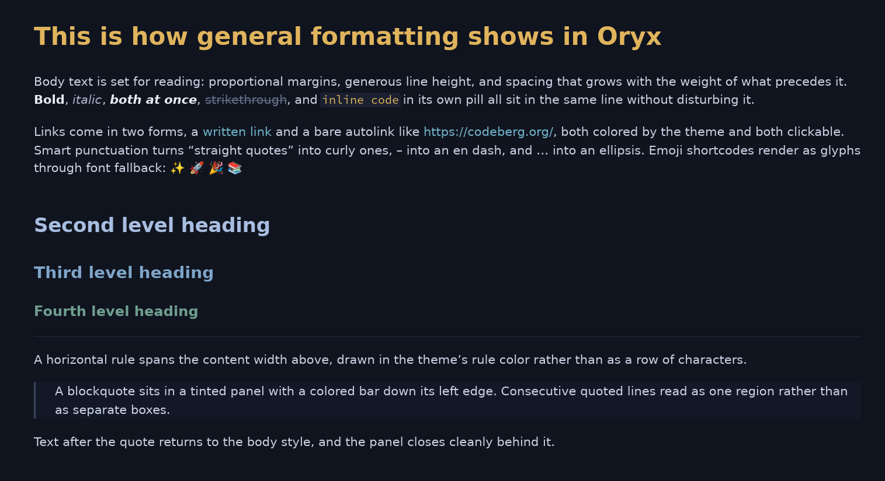

# Oryx

A fast, native viewer for markdown and code.


Most markdown tools are editors with a preview attached, or they embed a browser engine to draw text. Oryx is built for the reading case: the file you want to open, read and close, without an editor or a browser tab in the way. It renders documents natively in one small binary, opens them in a fraction of a second whatever their size, and ships with thirty-one themes and a PDF exporter.



[Why Oryx](#why-oryx) · [What it renders](#what-it-renders) · [Reading tools](#reading-tools) · [Themes](#themes) · [Export to PDF](#export-to-pdf) · [Install](#install) · [Use](#use) · [Performance](#performance) · [Limits](#limits)

## Why Oryx

**It opens instantly, whatever the size.** A normal document is on screen in well under 150 milliseconds from cold, and an 8MB file takes about a third of a second. Oryx highlights and lays out only the first few screens before it paints, then finishes the rest in the background while you read.

**It reads, it does not edit.** There are no panes, no toolbars and no menus. F1 lists every shortcut, Escape closes whatever is open, and everything works from the keyboard.

**There is nothing to install around it.** One binary and a folder of themes. No browser engine, no runtime, no GPU requirement. It behaves the same on a new laptop as on an old machine with no graphics card to speak of.

## What it renders

**Markdown, the whole everyday set.** Headings, bold, italic, strikethrough, inline code, links and bare URLs, nested blockquotes, horizontal rules, smart quotes and dashes, and emoji shortcodes like `:tada:`. Ordered, unordered and task lists nest as deep as needed, and a wrapped line aligns with the text above it, not with the bullet. Tables keep per-column alignment, shade alternating rows and wrap long cells, so a wide table never runs off the page.

**Code.** Fenced blocks get a bordered panel and syntax colors for the languages most people write, and a line too long for the panel wraps inside it. Oryx also opens source files directly and renders the whole file as one highlighted document. Close to a hundred extensions carry colors, from Rust and Python through Haskell, LaTeX, Makefiles and diffs. Any other text file opens in the code font, and a binary is announced in one line.


**The extras real documents use.** All five GitHub alert kinds are styled, each with its own color and title. A YAML frontmatter header becomes a small metadata panel above the document. TeX math comes out with real symbols, inline or centered on a line of its own. Footnote markers sit raised in the text and jump to their definitions, gathered at the foot of the document.

**Images and badges.** Local images render in place: PNG, JPEG, GIF, WebP or SVG. Remote images are fetched in the background and cached on disk, so a README covered in badges comes up immediately the second time it is opened, and keeps working offline. A broken path gets a placeholder carrying the alt text.

**The HTML that READMEs lean on.** Real READMEs use raw HTML for the things markdown cannot do, so Oryx handles the common subset: centered blocks, images at a set width or height, rows of clickable badges, line breaks, and the inline tags down to sub and sup.


## Reading tools

**Find in document.** Ctrl+F searches everywhere text is laid out, so list items, link text, table cells, quotes and code blocks all count. The search is smart about case. Type `oryx` and it matches Oryx, ORYX and oryx. Add a capital and only the exact form matches. A match can cross styling, so `fast viewer` is found even when it was written as **fast** *viewer*.

**Select and copy.** Ctrl+C copies a selection as plain text. Ctrl+Shift+C reproduces the original markdown of the selection, styles intact.

**Move around.** A folder sidebar on Ctrl+B shows the tree around the open file and can be driven entirely from the keyboard, with a type icon beside each file. Ctrl+O opens the native file dialog. Links open in the system browser, and links to headings scroll to their target. F5 reloads a file being edited elsewhere. Zoom sits on Ctrl+Plus and Ctrl+Minus for the current session.

**It remembers.** Window geometry, the active theme, the sidebar and the last folder all survive a restart.

## Themes

Thirty-one themes ship with Oryx. Each is a single TOML file with 51 color roles, so every element can be colored on its own. A missing key falls back to a default. A malformed file is skipped, and the active theme stays.

The browser on Ctrl+T previews themes and applies them live.


The editor changes any role with a color picker while the document restyles behind it. Editing a bundled theme writes a copy, so the shipped files stay as they were. A custom theme is one TOML file dropped in the themes directory.

Nine themes are original designs: `oryx-light` (the default) and its dark twin `oryx-dark`, `oryx-sand` and `oryx-night`, `inkstone`, `ember`, `meadow`, `slate`, and `be-vendible`. The rest adapt permissively licensed editor palettes, credited at the end.

## Export to PDF

Ctrl+E writes the document to a PDF and asks only where to put it. The page carries the document as it looks on screen: the theme's colors to the edge of the sheet, the same headings and code panels, images and badges in place, and links that still work in a reader. Headings become the outline a PDF viewer navigates by, text stays selectable and searchable, and the fonts travel inside the file.

Ctrl+Shift+E opens the export settings: theme, body font and size, code font and size, page size and page numbers. They are kept apart from the app's own appearance and remembered between runs, so reading in a dark theme at 22 points and exporting in a light one at 11 needs no switching back and forth. Sizes are points on paper, so 11 or 12 is the usual body figure.

Pages break where a reader would want them to: never through a line, never leaving a heading alone at the foot of a page, never splitting a table row, and never cutting an image in half.

## Install

### From a release

Download the archive for your platform from the [releases page](https://codeberg.org/wmahfoudh/oryx/releases), extract it, and run the installer inside:

```
tar -xzf oryx-*-linux-x86_64.tar.gz && cd oryx && ./install.sh
```

On Windows, extract the zip and run `install.ps1` in PowerShell. The installer copies the binary and themes and registers the file association, so markdown files open with Oryx from the file manager. `./install.sh --uninstall` removes everything.

### From source

Building requires Rust 1.80 or later.

```
git clone https://codeberg.org/wmahfoudh/oryx.git
cd oryx
make install
```

`make install` builds the release binary, installs it to `~/.local/bin`, copies the themes to `~/.local/share/oryx/themes` and registers the file association. Plain `cargo build --release` works too; the binary looks for `themes/` next to itself, in the XDG data directory, and in the working directory. Use a release build for everyday reading, because a debug build is noticeably slower on code-heavy documents.

## Use

> There are no menus. **Press F1** for the complete shortcut list, Escape to close a panel or quit.

```
oryx README.md          open a file
oryx src/main.rs        code files render highlighted
oryx --theme nord file  pick a theme for this session
oryx --register         install the file association and icons
oryx --version          print the version
```

| Shortcut | Action |
|---|---|
| Ctrl+O | Open file |
| Ctrl+, | Settings |
| Ctrl+T | Theme browser |
| Ctrl+B | Folder sidebar |
| Ctrl+E | Export to PDF |
| Ctrl+Shift+E | Export settings |
| F1 | Shortcuts help |
| F5 / Ctrl+R | Reload from disk |
| Ctrl+Plus / Ctrl+Minus | Zoom in / out |
| Ctrl+0 | Reset zoom |
| Ctrl+A | Select all |
| Ctrl+C | Copy selection as text |
| Ctrl+Shift+C | Copy selection as markdown |
| Ctrl+F | Find in document |
| F3 / Shift+F3 | Next / previous match |
| Up / Down | Scroll by line |
| Page Up / Page Down, Space / Shift+Space | Scroll by page |
| Home / End | Jump to top / bottom |
| Escape | Close overlay or sidebar, quit |

Ctrl is Cmd on macOS.

## Performance

Oryx parses the file when it opens, lays out the first screens, and paints a band that covers the viewport plus a couple of screens either side. Scrolling inside that band is a memory copy, so the cost of a scroll frame does not depend on how long the document is. Syntax highlighting and the layout below follow in the background, a slice at a time, without moving anything already on screen. The event loop wakes only for input, and an idle window uses no CPU at all.

Measured on one Linux machine, release build, from cold launch to the first frame:

| Document | First frame |
|---|---|
| 1MB source file | 81ms |
| 8MB source file | 90ms |
| 1MB markdown | 82ms |
| 8MB markdown | 317ms |

A performance test in the repository checks the startup, relayout and paint timings.

## Limits

Oryx is built for everyday documents, and some things are out of scope.

- It does not edit files.
- Math is drawn as styled text with real symbols, not fully typeset.
- On a file several megabytes long, the colors and the layout below the first screens take a moment to catch up.
- Memory grows with the file. An 8MB document costs a few hundred megabytes while it is open.
- The HTML it understands is a deliberate subset. No HTML tables, no collapsible sections.
- macOS compiles but is untested, and there is no packaged build.

## Contributing

Bug reports and theme contributions are welcome on the [issue tracker](https://codeberg.org/wmahfoudh/oryx/issues). Pull requests are read with interest. `make check` is the gate: formatting, clippy for the Linux, Windows and macOS targets, build, and the full test suite. The documents under `tests/showcase/` are the ones behind the screenshots above, and each exercises a single feature.

## Credits

DejaVu Sans and Courier Prime are embedded in the binary. DejaVu is distributed under the DejaVu Fonts License, Courier Prime under the SIL Open Font License. The settings dialog can switch to any family installed on the system.

The adapted themes come from these palettes, all MIT, with thanks to their authors:

- Dracula ([draculatheme.com](https://draculatheme.com))
- Nord ([nordtheme.com](https://www.nordtheme.com))
- Gruvbox dark and light ([morhetz/gruvbox](https://github.com/morhetz/gruvbox))
- Catppuccin Mocha and Latte ([catppuccin.com](https://catppuccin.com))
- Tokyo Night ([enkia/tokyo-night-vscode-theme](https://github.com/enkia/tokyo-night-vscode-theme))
- Solarized dark and light by Ethan Schoonover ([ethanschoonover.com/solarized](https://ethanschoonover.com/solarized))
- One Dark ([atom](https://github.com/atom/atom))
- Everforest dark and light ([sainnhe/everforest](https://github.com/sainnhe/everforest))
- Rosé Pine and Rosé Pine Dawn ([rosepinetheme.com](https://rosepinetheme.com))
- Kanagawa ([rebelot/kanagawa.nvim](https://github.com/rebelot/kanagawa.nvim))
- Ayu Mirage and Light ([ayu-theme](https://github.com/ayu-theme/ayu-colors))
- Night Owl by Sarah Drasner ([sdras/night-owl-vscode-theme](https://github.com/sdras/night-owl-vscode-theme))
- Horizon ([jolaleye/horizon-theme-vscode](https://github.com/jolaleye/horizon-theme-vscode))
- Flexoki dark and light by Steph Ango ([stephango.com/flexoki](https://stephango.com/flexoki))
- GitHub Light ([primer/primitives](https://github.com/primer/primitives))

## License

Oryx is free software, released under the [GNU General Public License v3.0](LICENSE).
