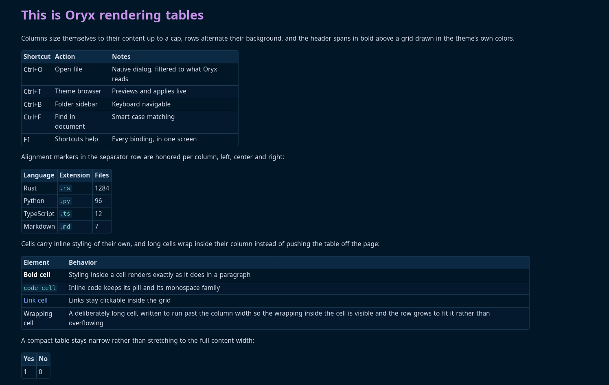
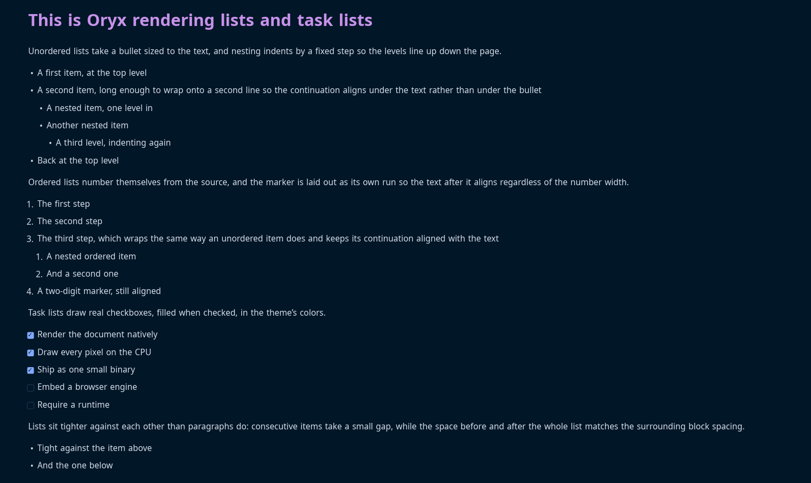
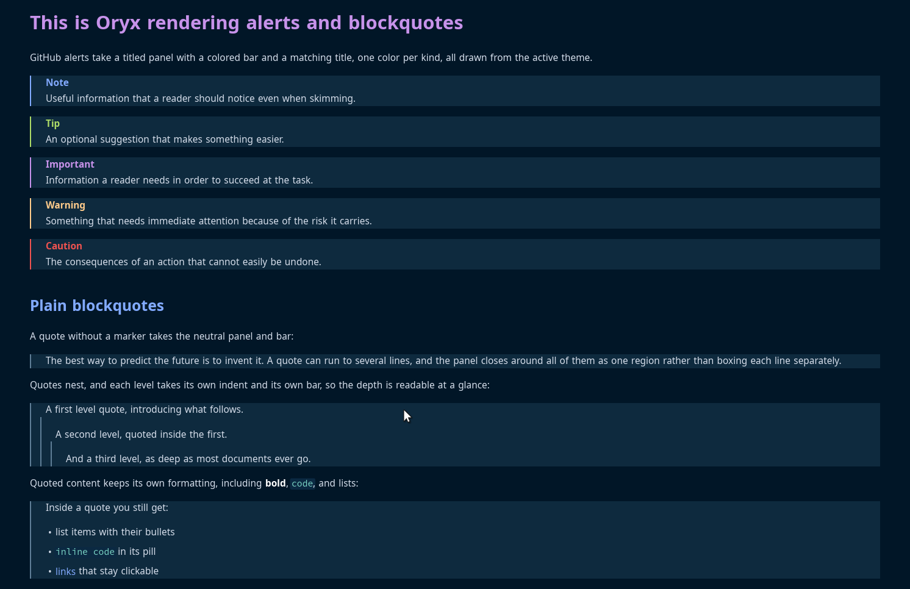
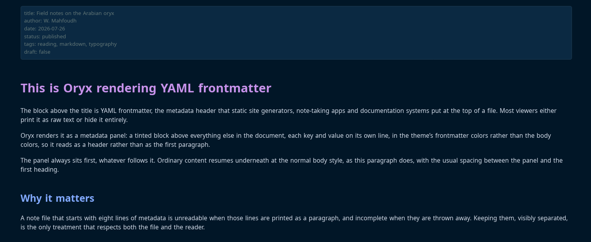
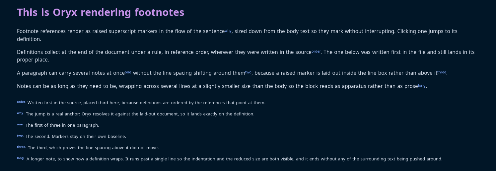
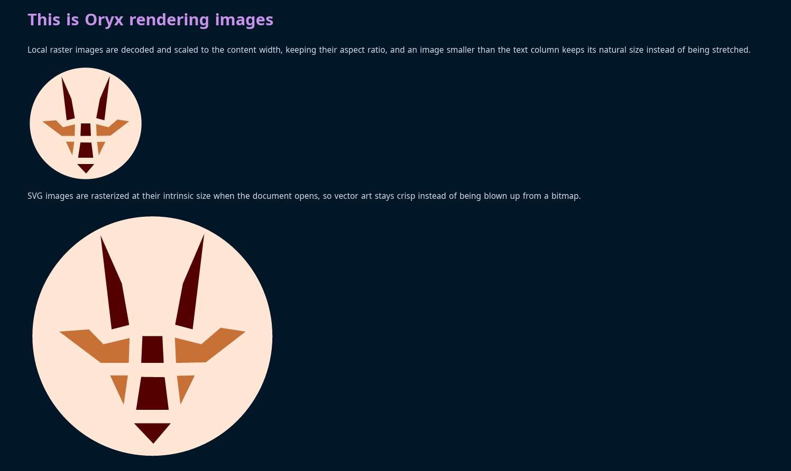

# Oryx

The fastest, most beautiful markdown and code viewer on the planet.


Oryx started as a personal need: reading a markdown file should not require opening an editor, a browser tab, or an Electron app. Most tools either edit with a preview attached or embed a web engine to draw text. I work with a lot of markdown and rarely edit it, so I wanted speed and convenience. Oryx renders markdown natively, in a single small binary that draws everything itself on the CPU, with the typography and theming a reader deserves, nothing else.

[Install](#install) · [Use](#use) · [Export](#export-to-pdf) · [Themes](#themes)

## Why Oryx

**It opens instantly, whatever the size.** A normal document is on screen in well under 150 milliseconds from cold, and an 8MB file takes about a third of a second. Oryx manages that by highlighting and laying out only the first few screens before it paints, then finishing the rest in the background while you read.

**It reads, it does not edit.** There are no panes and no toolbars. F1 lists every shortcut and Escape closes whatever is open.

**It is one binary and a folder of themes.** Every dependency is pure Rust, so there is nothing to install beside it and no browser engine hiding inside. It behaves the same on a new laptop as on an old machine with no GPU.

## What it shows

**Formatting.** The picture below covers most of it: headings, bold, italic, strikethrough, inline code, links and bare URLs, smart quotes and dashes, rules, nested blockquotes, and emoji shortcodes like `:tada:`.


**Code.** Fenced blocks get a bordered panel and syntax colors for the languages most people write. A line too long for the panel wraps inside it. You can also point Oryx straight at a source file and it renders the whole thing as one highlighted document. Close to a hundred extensions carry colors, from Rust and Python through Haskell, Scala, LaTeX, Makefiles and diffs. Anything else holding text still opens in the code font, so a `Makefile` or a `.conf` reads cleanly without them. Hand Oryx a binary and it says so in one line.


**Tables.** Columns keep the alignment you gave them, rows alternate their background, and each column sizes itself to its content up to a limit. A cell with a lot of text wraps inside its column, so a wide table never runs off the page.



**Lists.** Ordered, unordered, nested as deep as you like. A wrapped line lines up with the text above it, not with the bullet. Task lists get real checkboxes.



**Alerts.** All five GitHub alert kinds are styled: note, tip, important, warning and caution, each with its own color and title.



**Frontmatter.** A YAML header, the kind Obsidian and static site generators put at the top of a file, becomes a small metadata panel above the document. Most viewers either print it as a paragraph or throw it away.



**Math.** Math written as TeX comes out with real symbols: `\sum` is ∑, `\alpha` is α, and superscripts and subscripts sit where they should, whether the expression is inline in a sentence or centered on a line of its own.


**Footnotes.** Markers sit raised in the text and jump to their definitions, which gather at the foot of the document under a rule, in the order they were referenced.



**Images and badges.** Local images render, PNG or SVG. Remote ones are fetched in the background and cached on disk, so a README covered in shields.io badges comes up immediately the second time you open it, and keeps working offline. If a path is broken you get a placeholder with the alt text in it.



**GitHub READMEs.** Real READMEs lean on raw HTML for the things markdown cannot do, so Oryx handles the common subset: centered blocks, images at a set width or height, rows of clickable badges, line breaks, and the inline tags down to sub and sup.


**Find in document.** Ctrl+F searches, and the search is smart about case: type `oryx` and you match Oryx, ORYX and oryx; add a capital and only Oryx matches. It looks everywhere text is laid out, so list items, link text, table cells, quotes and code blocks all count. A match can run across styling, so `fast viewer` turns up even when it was written as **fast** *viewer*, though it will not run from one block into the next.

**Interface.** A folder sidebar you can drive from the keyboard, showing a type icon beside each file. A native open dialog. Selection with copy as plain text or as the original markdown. Per-session zoom, reload from disk for files you are editing elsewhere, and the shortcuts screen on F1. Window geometry, the sidebar and the folder you were last in are remembered between runs.

## Install

### From a release

Download the archive for your platform from the [releases page](https://codeberg.org/wmahfoudh/oryx/releases), extract it, and run the installer inside:

```
tar -xzf oryx-*-linux-x86_64.tar.gz && cd oryx && ./install.sh
```

On Windows, extract the zip and run `install.ps1` in PowerShell. The installer copies the binary and themes, and registers the file association so markdown files open with Oryx from your file manager. `./install.sh --uninstall` removes everything.

### From source

Requires Rust 1.80 or later.

```
git clone https://codeberg.org/wmahfoudh/oryx.git
cd oryx
make install
```

`make install` builds the release binary, installs it to `~/.local/bin`, copies the themes to `~/.local/share/oryx/themes`, and registers the file association. Plain `cargo build --release` works too; the binary looks for `themes/` next to itself, in the XDG data directory, and in the working directory. For everyday reading use the installed binary or `--release`: a plain debug build is noticeably slower on code-heavy documents.

## Use

> There are no menus. **Press F1** for the complete shortcut list, Escape to close a panel or quit.

```
oryx README.md          open a file
oryx src/main.rs        code files render highlighted
oryx --theme nord file  pick a theme for this session
oryx --register         install the file association and icons
oryx --version          print the version
```

| Shortcut | Action |
|---|---|
| Ctrl+O | Open file |
| Ctrl+, | Settings |
| Ctrl+T | Theme browser |
| Ctrl+B | Folder sidebar |
| Ctrl+E | Export to PDF |
| Ctrl+Shift+E | Export settings |
| F1 | Shortcuts help |
| F5 / Ctrl+R | Reload from disk |
| Ctrl+Plus / Ctrl+Minus | Zoom in / out |
| Ctrl+0 | Reset zoom |
| Ctrl+A | Select all |
| Ctrl+C | Copy selection as text |
| Ctrl+Shift+C | Copy selection as markdown |
| Ctrl+F | Find in document |
| F3 / Shift+F3 | Next / previous match |
| Up / Down | Scroll by line |
| Page Up / Page Down, Space / Shift+Space | Scroll by page |
| Home / End | Jump to top / bottom |
| Escape | Close overlay or sidebar, quit |

Ctrl is Cmd on macOS. Copy as markdown reproduces the original source of the selection, styles intact.

## Export to PDF

Ctrl+E writes the document to a PDF and asks only where to put it. The page carries the document as you are reading it: the theme's colours to the edge of the sheet, the same headings and code panels, images and badges in place, and links that still work in a reader. Headings become the outline a viewer navigates by, text stays selectable and searchable, and the fonts travel inside the file so it reads the same anywhere.

Ctrl+Shift+E opens the settings first. Theme, body font and size, code font and size, page size and page numbers, kept apart from the app's own appearance and remembered between runs. That separation is the point: read in a dark theme at 22 points and export in a light one at 11, without changing how Oryx looks. Set it once, then Ctrl+E from then on.

Sizes are points on paper rather than pixels on a screen, so 11 or 12 is the usual figure for a body size. Pages break where a reader would want them to: never through a line, never leaving a heading alone at the foot of a page, never splitting a table row or a single line off a paragraph, and never cutting an image in half.

## Themes

Thirty-one themes ship with Oryx. Each one is a single TOML file with 51 color roles, so every element can be colored on its own. Leave a key out and it falls back to a default. Write something malformed and Oryx skips the file and keeps the theme it already had.

The browser on Ctrl+T previews them and applies them live.


The editor changes any role with a color picker while the document restyles behind it. Edit one of the bundled themes and Oryx quietly edits a copy, so the files it shipped with stay as they were.


Nine are original designs: `oryx-light` (the default) and its dark twin `oryx-dark`, `oryx-sand` and `oryx-night`, `inkstone`, `ember`, `meadow`, `slate`, and `be-vendible`. The rest adapt permissively licensed editor palettes, credited below.

## Performance

Oryx works in four stages: load, layout, paint, present. It parses the file when you open it, lays the blocks out in order, and paints a band that covers the viewport and a couple of screens either side. Scrolling inside that band is a memory copy, which is why the cost of a scroll frame has nothing to do with how long the document is. The event loop wakes only for input, so an idle window uses no CPU at all.

Both of the expensive stages are given a time budget rather than being allowed to block, and that is what makes a large file feel like a small one.

**Syntax highlighting.** Opening a file spends about forty milliseconds coloring code, and a background thread sends the rest along in chunks. Each chunk recolors lines that have already been laid out, so nothing moves on screen.

**Text layout.** Opening lays out the first screens and the rest follows in order, a slice at a time, between frames. A position is exact as soon as it exists and never shifts afterwards, so a selection you make while the document is still filling stays where you put it. Zoom, the sidebar and window resizing all run through the same machinery. The scrollbar tracks what has been laid out so far.

Measured on one Linux machine, release build, from launch to the first frame. The eager column is the same two stages with their budgets removed, the way earlier versions worked.

| Document | Eager | Budgeted |
|---|---|---|
| 1MB source file | 4.6s | 81ms |
| 8MB source file | 38s | 90ms |
| 1MB markdown | 1.8s | 82ms |
| 8MB markdown | 14s | 317ms |

Opening a source file is effectively constant time at any size.

A performance test in the repository checks the startup, relayout and paint timings.

## Limits

Oryx is built for everyday documents, and there are things it will not do.

- It does not edit files.
- Math is drawn as styled text with real symbols, not properly typeset.
- Open something several megabytes long and the colors, and the layout below the first screens, take a moment to catch up.
- Memory grows with the file. An 8MB document costs a few hundred megabytes while it is open.
- The HTML it understands is a deliberate subset. No HTML tables, no collapsible sections.
- macOS compiles, but it is untested and there is no packaged build.

Some of these are on the list for future versions; none of them are promises.

## Under the hood

The layout engine draws everything, which means the rendering can be tested as numbers rather than by eye. More than 300 tests assert positions, wrapping, spacing and colors, and the exported PDFs are read back through an independent parser rather than checked against themselves. Every color on screen comes from the active theme file. Every dependency is pure Rust, and that is what keeps the binary small, the startup quick and the build straightforward on all three platforms.

The files under `tests/showcase/` are the documents behind the screenshots above. Each one exercises a single feature, and they are worth opening to see what Oryx makes of them.

Bug reports and theme contributions are welcome on the [issue tracker](https://codeberg.org/wmahfoudh/oryx/issues). Pull requests are read with interest, though without promises. `make check` is the gate: formatting, clippy for the Linux, Windows and macOS targets, build, and the full test suite.

## Credits

DejaVu Sans and Courier Prime are embedded in the binary. DejaVu is distributed under the DejaVu Fonts License, Courier Prime under the SIL Open Font License. The settings dialog can switch to any family installed on your system.

The adapted themes come from these palettes, all MIT, with thanks to their authors:

- Dracula ([draculatheme.com](https://draculatheme.com))
- Nord ([nordtheme.com](https://www.nordtheme.com))
- Gruvbox dark and light ([morhetz/gruvbox](https://github.com/morhetz/gruvbox))
- Catppuccin Mocha and Latte ([catppuccin.com](https://catppuccin.com))
- Tokyo Night ([enkia/tokyo-night-vscode-theme](https://github.com/enkia/tokyo-night-vscode-theme))
- Solarized dark and light by Ethan Schoonover ([ethanschoonover.com/solarized](https://ethanschoonover.com/solarized))
- One Dark ([atom](https://github.com/atom/atom))
- Everforest dark and light ([sainnhe/everforest](https://github.com/sainnhe/everforest))
- Rosé Pine and Rosé Pine Dawn ([rosepinetheme.com](https://rosepinetheme.com))
- Kanagawa ([rebelot/kanagawa.nvim](https://github.com/rebelot/kanagawa.nvim))
- Ayu Mirage and Light ([ayu-theme](https://github.com/ayu-theme/ayu-colors))
- Night Owl by Sarah Drasner ([sdras/night-owl-vscode-theme](https://github.com/sdras/night-owl-vscode-theme))
- Horizon ([jolaleye/horizon-theme-vscode](https://github.com/jolaleye/horizon-theme-vscode))
- Flexoki dark and light by Steph Ango ([stephango.com/flexoki](https://stephango.com/flexoki))
- GitHub Light ([primer/primitives](https://github.com/primer/primitives))

## License

Oryx is free software, released under the [GNU General Public License v3.0](LICENSE).
