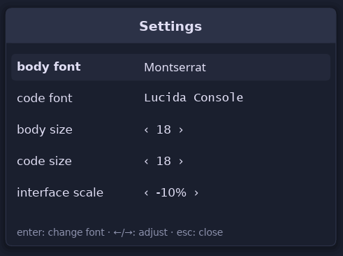
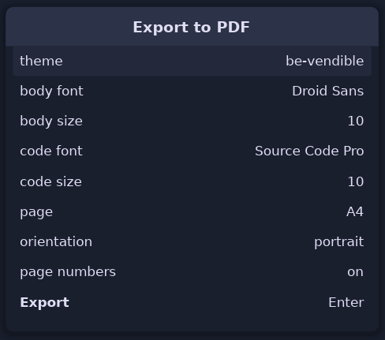

<div align="center">


</div>

<b>Quick Links</b>

- [Installation](#install)
- [Performance](#performance)
- [Credits](#credits)

## Philosophy

Oryx started as a personal project. I work with markdown files and did not find a (very) fast tool that could render them beautifully on the desktop without a browser or an Electron app and without a third party watching my personal notes. Exporting to (a nice-looking) PDF would have been a plus. That was the first version of the functional specs. Oryx has grown a lot since: it became a universal reader and a light editor, and it stayed fast and beautiful.

Most markdown editors start by showing the code and then trying to render it. I think the fact that Oryx was designed to be a renderer and not an editor made it something different; after all, nobody develops a browser to start by showing raw HTML. Afterwards, editing and reading ebooks came along the way; it was a consequence. Some ideas like rendering PDF files were tested and rejected. PDF reading would have grown the binary by 5.5 MB and would not have added anything better to the community. Features that will remain within `Fast & Beautiful` could be added in the future. Others like git or agentic work integration probably won't. Hopefully, Oryx will remain:  

- **Instant**: A document displays in under 100 ms from cold, even an 8 MB markdown file or a 200 MB ebook.
- **Light**: Memory stays flat however you scroll, whatever the file size. The same speed on a new laptop or an old machine with no graphics card (like mine).
- **Distraction-free**: No panes, no toolbars, no menus. `F1` lists the shortcuts, `Esc` closes whatever is open.
- **Beautiful**: 30+ themes, with 51 color roles each, for reading and for PDF export alike.
- **Self-contained**: One binary and a folder of themes and examples. No browser engine, no runtime, no GPU requirement and no need to download themes or syntax highlighting stuff. 
- **Opinionated**: Nobody renders justified markdown :smile: and most ebook readers do not dare to strip the books' CSS and apply their own. 

## Oryx Scope

The complete recognized syntax, markdown and embedded HTML, is listed in [SYNTAX.md](SYNTAX.md). The [examples](examples/) folder is installed with Oryx and shows the syntax on real documents.

### Markdown

Headings, bold, italic, strikethrough, inline code, links and bare URLs (a link to another file opens it in Oryx), nested blockquotes, horizontal rules, smart quotes and dashes, and emoji shortcodes like `:tada:` :tada:. Ordered, unordered and task lists nest as deep as needed. A lot of care was given to details: for example, a wrapped line aligns with the text above it, not with the bullet, and tables keep per-column alignment, shade alternating rows and wrap long cells, so a wide table does not run off the page.

### Source code

Oryx displays fenced blocks in a bordered panel with syntax colors for code. A code line too long wraps inside the panel. Oryx also opens source files directly and renders them as one highlighted document. Over a hundred extensions are supported, from Rust and Python to Terraform and Zig. Some files like a `Dockerfile` or a `Makefile` are recognized by name. Any other text file opens in the code font.


### GitHub flavor and more

The five GitHub alerts are styled, each with its own color and title. Oryx shows a YAML frontmatter header as a small metadata panel above the document. Footnote markers appear raised in the text and link to their definitions, gathered at the foot of the document; `Alt+Left` returns to where you were reading.

**Images and badges**: Supported formats are PNG, JPEG, GIF, WebP or SVG. Remote images are fetched in the background and cached on disk, so a file with badges comes up immediately the second time it is opened, and keeps working offline. A cached image older than a day is refreshed in the background the next time the file opens. If a path is broken, the image is replaced by a placeholder showing the alt text, or the file name when there is none.

**Embedded HTML** covers what GitHub renders: tables with or without a header row, collapsible `<details>` sections, HTML headings, lists and quotes, definition lists, centered blocks, images at a set width or height, rows of clickable badges, and the inline tags down to `mark`, `kbd` and `small`. Search sees into a closed section, and jumping to a match unfolds it.


### Math

Oryx typesets TeX math in the STIX Two Math font: fractions, radicals, matrices, stretched delimiters and stacked limits. It recognizes all four GitHub notations: `$...$`, `$$...$$`, a `math` fence, and the backtick form ``$`...`$``. Oryx infers whether a dollar sign is a currency or a math delimiter, so prices like `$5-$10` do not mess up rendering.

The command vocabulary is KaTeX compatible: Greek, binary operators, relations and their negations, arrows, accents, the seven math alphabets, operator names, spacing, the matrix environments, and `\newcommand` macros. If Oryx encounters an unknown command, it will render it as its literal source, and the rest of the equation renders normally. An equation wider than the window shrinks to fit (to a reasonable extent). PDF export includes the typeset math, and text copied from the PDF reads back as the equation's characters. The supported commands are listed in [SYNTAX.md](SYNTAX.md#math), and [examples/sample-math.md](examples/sample-math.md) shows many of them in one document.


## Books

Oryx opens EPUB, FB2, MOBI and AZW3 (Kindle) books and renders them as one continuous document, in the active theme rather than the book's own styling. The book keeps its structure: chapter headings, italics and bold (including the ones its stylesheet sets), images and the cover, tables and highlighted code. The first chapters display immediately and the rest of the book loads in the background. The window title shows the book's title and its format, which helps when the same book exists in several formats. FB2 files zipped as `.fb2.zip` or `.fbz` open too.

Book text is justified: lines end at the same right edge, and the last line of each paragraph stays ragged, like print. `Ctrl+J` turns justification off and on. Markdown files can justify too; they start ragged, and each kind remembers its own choice.

The sidebar's Outline tab shows the book's own table of contents, follows the reading position and jumps on a click. Links inside the book work, so a footnote reference jumps to its note, and `Alt+Left` comes back, one jump at a time. Ebooks reopen where reading stopped, even after Oryx is closed; other files open at the top on a new start.

DRM-protected books and fixed-layout EPUB books are not supported. The [examples](examples/) folder installed with Oryx includes *The Adventures of Sherlock Holmes* to try it on.

### Arabic and Hebrew

Oryx reads right-to-left books. The direction is detected paragraph by paragraph from the text itself (book metadata is often wrong about this), so a book that mixes English and Arabic shows each paragraph on its correct side. Justified Arabic stretches to both edges with the last line of each paragraph ending on the right, the way printed Arabic does. Lists, quotes and headings follow the direction of their text, and selection, search and PDF export work as in any other document.

Two fonts are embedded for this: Amiri for Arabic (a revival of the typeface classical Arabic books were printed in) and David Libre for Hebrew (a digitization of David, a typeface widely used in Hebrew books). Arabic and Hebrew text is rendered in them whatever the selected body font is.

<p align="center">
  
</p>

<p align="center">
  
</p>

If Oryx reads a book's direction wrong, `Ctrl+D` switches it: automatic, right to left, left to right. The choice is remembered for each book.

### Comic books

Oryx opens CBZ and CBR comic book archives and shows the pages in reading order. A comic starts as a vertical strip, every page at the window's width, which reads naturally for webtoons. `Ctrl+Minus` switches to one whole page per screen, and once more to two pages side by side, like an open book; `Ctrl+Plus` goes back up, and `Ctrl+0` shows the whole page from anywhere. In the page views, Up, Down and Space turn pages. For comics that read right to left, like manga, `Ctrl+D` flips the two-page order, and Oryx remembers it for that comic. The outline lists the pages, and Oryx reopens a comic at the page where reading stopped.

Comic book contents are analyzed and files processed accordingly, not by name, so a `.cbr` that is really a `zip` (they are common) works anyway. When an archive is password-protected or damaged, Oryx displays the problem. Compressed `CBR` files are rare and not supported.

## Tools

- **Find in document**: `Ctrl+F` searches text. The search is smart about case: `oryx` matches Oryx, ORYX and oryx, while `Oryx` performs an exact match. A match can cross styling, so `fast viewer` is found even when it was written as `**fast** *viewer*`, and it can cross a wrapped line. The whole document is searchable even while a big file is still loading. The `.*` button in the search bar (or `Alt+R`) switches to regular expressions, in the Rust `fancy-regex` flavor, so capture groups, backreferences and lookarounds are available. `^` and `$` match at line starts and ends, and on the rendered page each block counts as one line. While a pattern is incomplete, the bar's border changes color instead of showing a match count. Clicking anywhere in the document closes the search bar.
- **Select and copy**: `Ctrl+C` copies a selection as plain text. `Ctrl+Shift+C` copies the original markdown of the selection. A double click selects the word, a triple click the paragraph, the code line or the table cell. Select all is instant at any file size, a selection survives zooming, theme switches and window resizes, and both copies work before a big file has finished loading.
- **Sidebar**: `Ctrl+Shift+B` opens a two-tab panel: the folder tree around the open file, and an outline of the document's headings that tracks the reading position, folds its branches, and jumps on a click. For a book, the outline is its table of contents. Both tabs drive entirely from the keyboard. A folder reached through a symbolic link is listed too, and opening it moves the tree to the real folder.
- **Open file**: `Ctrl+O` opens the native file dialog.
- **Live reload**: Oryx notices when the open file changes on disk and reloads it, as long as there are no unsaved edits. `F5` / `Ctrl+R` reload on demand.
- **Zoom**: `Ctrl+Plus` (in) and `Ctrl+Minus` (out), or the mouse wheel with `Ctrl` held.
- **Display scale**: Oryx follows the display's scale, so text and controls render at the intended size on a scaled screen (a laptop at 200%, for example). An `interface scale` entry in the settings (`Ctrl+,`) adjusts the size around the detected value, from -50% to +100%, and is remembered.
- **Touch**: On a touch screen, swiping scrolls the document, the sidebar and the dialogs. A swipe released while moving keeps the document scrolling with momentum. Tapping clicks, and a two-finger pinch zooms the document.
- **Persistence**: Window geometry, the active theme, the sidebar and the last folder are all saved and restored at every start. While Oryx is open, switching between files keeps each file's place: a file left mid-edit comes back in the editor, at the same spot.

<p align="center">
  
</p>

## Editing

Press `Ctrl+E` to enter edit mode, with a caret and the usual keys; `Escape` (or `Ctrl+E` again) returns to reading. The window title shows `editing` and a thin line in the theme's selection color runs along the top of the page, so the mode is always visible.

Source code and plain text files edit on the page itself. A markdown file shows its own source instead: the page is replaced by the markdown text, drawn in the theme's colors with the markers visible. `Escape` brings the view mode with the edits applied.

During a session, you can switch between files and Oryx will remember the reading or editing position. 

Books cannot be edited, and neither can a file whose text did not read cleanly, since Oryx could not write it back exactly as it was. A small notice in the corner will tell you when editing is not available.

Editing works the way a text editor does: typing, selections, `Ctrl+X` and `Ctrl+V`, undo with `Ctrl+Z`, redo with `Ctrl+Shift+Z` or `Ctrl+Y`. While editing, `Ctrl+Left` / `Ctrl+Right` jump by word, `Ctrl+Home` / `Ctrl+End` jump to the ends of the file, and `Ctrl+Backspace` / `Ctrl+Delete` delete by word. Typing is instant even in very large files.

`Enter` keeps the indentation of the current line. In a markdown file it also continues what you are writing: a list item gets the next marker (numbered lists count on), a task item continues unchecked, and a quoted line keeps its `>`. `Enter` on an empty item ends the list. `Tab` indents and `Shift+Tab` removes an indent, on every line of a selection at once; with the caret at a list marker, `Tab` nests the item. Whether `Tab` inserts a tab or spaces follows what the file already uses.

`Ctrl+H` opens find and replace: a second field appears under the search box. `Enter` replaces the current match and moves to the next, `Ctrl+Enter` replaces every match at once, and one `Ctrl+Z` brings a replace-all back. With regular expressions, the replacement can reuse captured groups: searching `(\w+)/(\w+)` and replacing with `$2/$1` swaps the two sides of every pair. The replace field only exists in the editor; the search itself works everywhere.

A task checkbox can be ticked by clicking it on the page, without entering edit mode. Nothing else on the page moves, `Ctrl+Z` undoes it, and `Ctrl+S` saves it.

`Ctrl+S` saves. Oryx is careful with the file: lines that were not touched are written back unchanged, and every line keeps its own ending, so a file with Windows line endings stays that way. The window title shows a dot next to the file name while changes are unsaved. `Ctrl+Shift+S` saves under a new name.

`Ctrl+N` creates a new file: the save dialog opens first, then the empty page is ready to type into. That is how Oryx knows the type of file you created to be able to apply syntax colors.

Closing the window, quitting or reloading with unsaved changes asks first: `Enter` saves, `D` discards, `Escape` keeps editing. If the file changes on disk while there are unsaved edits, Oryx shows a notice and leaves the edits alone.

## Themes

Thirty plus themes ship with Oryx. Editable TOML files with **51 color roles**, so every possible markdown element can be colored separately.

Press `Ctrl+T` to open the theme browser. Arrow keys move through the list and preview the selected theme, `Enter` validates and closes the browser, and `Escape` restores the previous one (cancels):

<p align="center">
  
</p>

The theme editor changes any color role through a color picker while the document restyles live. Editing a bundled theme creates a copy, so the shipped files remain unchanged. A custom theme is a TOML file saved in the themes directory.

<p align="center">
  
</p>

Ten themes are original designs: `oryx-light` and its dark twin `oryx-dark`, `oryx-hero`, `oryx-sand` and `oryx-night`, `inkstone`, `ember`, `meadow`, `slate`, and `be-vendible`. The rest adapt permissively licensed editor palettes, [credited below](#credits).

> [!TIP]
> You can drop an existing theme file into Claude Design or Gemini, describe or share a link to something you love and ask it to generate an Oryx-compatible theme.

## Export to PDF

`Ctrl+Shift+P` opens the export settings: theme, body font and size, code font and size, page size, orientation and page numbers. Six page sizes are available: A4, Letter and Legal, and the book trim sizes. When the document is a book, a justify toggle is also present. Oryx separates the export settings from the app's own appearance and remembers them between runs. The idea is that reading in a dark theme at 22 points and exporting in a light one at 11 should not need switching back and forth each time we need an export.

<p align="center">
  
</p>

`Ctrl+P` exports the document using the configured export settings. After setting your preferences, this is usually the way to go. Markdown headings are converted to PDF outlines, and the fonts are embedded. Emoji render in the PDF as images. A book exports with each chapter starting on a new page, and its table of contents becomes the PDF outline.

**During export, Oryx tries to avoid that**:

- Page breaks happen through a line
- Headings are left alone at the foot of a page
- Images are cut
- Table rows are split between pages (unless the row is taller than the page itself)

## Install

### From a release

Download the archive for your platform from the releases page on [Codeberg](https://codeberg.org/wmahfoudh/oryx/releases) or [GitHub](https://github.com/wmahfoudh/oryx/releases), extract it, and run the installer inside:

```sh
tar -xzf oryx-*-linux-x86_64.tar.gz && cd oryx && ./install.sh
```

On Windows, extract the zip and run `install.ps1` in PowerShell. The installer copies the binary, the themes and the example documents, and registers the file association, so markdown files and books open with Oryx from the file manager. `./install.sh --uninstall` removes everything.

### From source

Building requires **Rust 1.80 or later**.

```sh
git clone https://codeberg.org/wmahfoudh/oryx.git   # or https://github.com/wmahfoudh/oryx.git
cd oryx
make install
```

`make install` builds the release binary, installs it to `~/.local/bin`, copies the themes and examples to `~/.local/share/oryx` and registers the file association. Plain `cargo build --release` works too; the binary looks for `themes/` next to itself, in the XDG data directory, and in the working directory.

> [!TIP]
> Use a release build, because a debug build is noticeably slower on code-heavy documents.

## Using Oryx

After installing, open Oryx from the launcher and browse folders and files through the sidebar. Started without a file, Oryx shows a short page with the basic shortcuts. You can also drag and drop a file onto the window to open it, or a folder to browse it. On macOS, `Cmd` works wherever the shortcuts below say `Ctrl`.

> [!NOTE]
> There are no menus. **Press `F1`** for the complete shortcut list. `Esc` or a click outside closes a dialog, and `Esc` quits.

```sh
oryx README.md          # open a file
oryx book.epub          # books read in the active theme
oryx src/main.rs        # code files render highlighted
oryx notes/             # open the sidebar on a folder
oryx --theme nord file  # pick a theme for this session
oryx --register         # install the file association and icons
oryx --clear-cache      # remove the downloaded remote images
oryx --version          # print the version
oryx --help             # list these options
```

| Shortcut | Action |
|---|---|
| **Files** | |
| `Ctrl+O` | Open a file |
| `Ctrl+N` | New file |
| `Ctrl+S` | Save (editing) |
| `Ctrl+Shift+S` | Save as (editing) |
| `F5` / `Ctrl+R` | Reload from disk |
| `Ctrl+Shift+R` | Reload and refetch remote images |
| **Navigation** | |
| `Up` / `Down` | Scroll by line, or move the sidebar selection |
| `Page Up` / `Page Down`, `Space` / `Shift+Space` | Scroll by page |
| `Home` / `End` | Jump to top / bottom |
| `Alt+Left` | Go back after a link or outline jump |
| `Ctrl+Shift+B` | Toggle sidebar (files and outline) |
| `Left` / `Right` | Toggle between sidebar and document |
| `Ctrl+Tab` | Toggle the sidebar tab |
| **Find** | |
| `Ctrl+F` | Find in document |
| `F3` / `Shift+F3` | Next / previous match |
| **Selection** | |
| `Ctrl+A` | Select all |
| `Ctrl+C` | Copy selection as text |
| `Ctrl+Shift+C` | Copy selection as markdown |
| **Edit** | |
| `Ctrl+E` | Edit the document |
| `Ctrl+X` / `Ctrl+V` | Cut / paste (editing) |
| `Ctrl+Z` | Undo the last edit |
| `Ctrl+Shift+Z` / `Ctrl+Y` | Redo an undone edit |
| **View** | |
| `Ctrl+T` | Choose a theme |
| `Ctrl+,` | Change fonts and sizes |
| `Ctrl+Plus` / `Ctrl+Minus` | Zoom in / out; in a comic, switch between page views |
| `Ctrl+0` | Reset zoom; in a comic, show the whole page |
| `Ctrl+J` | Justify prose (markdown and books) |
| `Ctrl+D` | Reading direction: automatic, right to left, left to right |
| **Export** | |
| `Ctrl+P` | Export to PDF |
| `Ctrl+Shift+P` | Choose export settings, then export |
| **Help** | |
| `F1` | Open the help page, and close it |
| `Escape` | Close overlay, clear the selection, leave editing, quit |

`Ctrl` is `Cmd` on macOS.

## Performance

Performance is one of the motivations behind Oryx. Many markdown viewers start struggling above one megabyte of file size, without even offering a decent look. Oryx keeps the same beautiful reading experience, whatever the file size and whatever the machine. Benchmarks have been reproduced for all supported file types, like ebooks. Here is how it works:

For a big markdown file, Oryx parses only its first screens before the first paint and the rest arrives from a background thread. It uses all CPU cores to build the layout, for the wash-in below the first screens as well as every zoom or resize. Only the part of the document around the reading position is kept in drawn form, and scrolling rebuilds the landing from recorded positions in about a millisecond; memory stays flat however long the document is. Painting covers a band around the viewport, a couple of screens either side, and scrolling inside that band is a memory copy: the cost of a scroll frame does not depend on the document's length. Syntax highlighting and the layout below follow in the background, a slice at a time, without moving anything already on screen.

A PDF export streams pages to disk as they are laid out, and even a five-thousand-page export runs in a few megabytes of working memory. A book opens the same way: the first chapters parse before the first paint, and the rest of the book arrives in the background, images included. The event loop wakes only for input, and an idle window uses **no CPU at all**.

Measured on a 2019 Linux laptop, release build. First frame is cold launch to first paint; the export column is the export itself, measured after syntax highlighting has settled:

| Document | First frame | PDF export |
|---|---|---|
| 1 MB source file | **80 ms** | 1.3 s |
| 8 MB source file | **85 ms** | 10.2 s |
| 1 MB markdown | **80 ms** | 1.2 s |
| 8 MB markdown | **80 ms** | 10.7 s |

The 8 MB markdown export writes a 9219-page file. While open, the 8 MB markdown file reads in about 200 MB of memory and the 8 MB source file in about 90 MB. The sample book, *The Adventures of Sherlock Holmes*, parses its first chapters in 9 ms and exports its 211 pages in 0.8 s. Performance tests in the repository check the startup, relayout, paint and export timings and the memory figures.

> [!NOTE]
> Oryx is not a markdown-to-PDF converter. Its export reproduces the page you read, pixel for pixel: the theme, every shaped glyph, syntax colors for close to a hundred languages, images, links, the outline and the embedded fonts, at a millisecond or two per finished page whatever the document size. Raw conversion without any of that is a different, far faster job: a few milliseconds for a whole small file.

## Limitations

- On a file several megabytes long, the layout below the first screens takes a moment to catch up. Syntax colors appear right away wherever you are reading, and a few lines can change color a moment later, once the full pass reaches them. An export waits for syntax highlighting to finish before it writes, so on the 8 MB file the wall time can be double the export column above.
- The implemented HTML is a subset: what GitHub renders in a README, nothing more.
- Editing types in any keyboard layout, but Chinese, Japanese and Korean input methods are not supported.
- Remote images use the operating system's TLS stack, which on Linux means it needs the OpenSSL library (normally shipped with every distro). Without it, badges show placeholders but everything else works.
- macOS compiles but is untested, and there is no packaged build as I don't have a Mac. The Windows release is compiled on my Linux machine.

## Credits

DejaVu Sans, Courier Prime, STIX Two Math, Amiri and David Libre are embedded in the binary. DejaVu is distributed under the DejaVu Fonts License, the other four under the SIL Open Font License. STIX renders the math and stays out of the font picker; Amiri renders Arabic and David Libre renders Hebrew. The settings dialog can switch the text fonts to any family installed on the system.

The sample book in [examples](examples/) is the [Standard Ebooks](https://standardebooks.org) edition of *The Adventures of Sherlock Holmes*, in the public domain and dedicated with CC0 by its producers.

<details>
<summary><b>Adapted theme palettes</b> (all MIT, with thanks to their authors)</summary>

- Dracula ([draculatheme.com](https://draculatheme.com))
- Nord ([nordtheme.com](https://www.nordtheme.com))
- Gruvbox dark and light ([morhetz/gruvbox](https://github.com/morhetz/gruvbox))
- Catppuccin Mocha and Latte ([catppuccin.com](https://catppuccin.com))
- Tokyo Night ([enkia/tokyo-night-vscode-theme](https://github.com/enkia/tokyo-night-vscode-theme))
- Solarized dark and light by Ethan Schoonover ([ethanschoonover.com/solarized](https://ethanschoonover.com/solarized))
- One Dark ([atom](https://github.com/atom/atom))
- Everforest dark and light ([sainnhe/everforest](https://github.com/sainnhe/everforest))
- Rosé Pine and Rosé Pine Dawn ([rosepinetheme.com](https://rosepinetheme.com))
- Kanagawa ([rebelot/kanagawa.nvim](https://github.com/rebelot/kanagawa.nvim))
- Ayu Mirage and Light ([ayu-theme](https://github.com/ayu-theme/ayu-colors))
- Night Owl by Sarah Drasner ([sdras/night-owl-vscode-theme](https://github.com/sdras/night-owl-vscode-theme))
- Horizon ([jolaleye/horizon-theme-vscode](https://github.com/jolaleye/horizon-theme-vscode))
- Flexoki dark and light by Steph Ango ([stephango.com/flexoki](https://stephango.com/flexoki))
- GitHub Light ([primer/primitives](https://github.com/primer/primitives))
    
</details>

<details>
<summary><b>Bundled grammars</b> (beyond syntect's defaults, with thanks to their authors)</summary>

- TOML ([sublimehq/Packages](https://github.com/sublimehq/Packages))
- INI ([jwortmann/ini-syntax](https://github.com/jwortmann/ini-syntax), MIT)
- Kotlin ([guille/sublime-kotlin](https://github.com/guille/sublime-kotlin), public domain)
- Swift ([aerobounce/Swift-Next](https://github.com/aerobounce/Swift-Next), MIT)
- TypeScript and TSX, Microsoft's grammars (Apache-2.0) as converted by [bat](https://github.com/sharkdp/bat)
- Dockerfile ([keith-hall/Containerfile-sublime-syntax](https://github.com/keith-hall/Containerfile-sublime-syntax), MIT)
- Zig ([ziglang/sublime-zig-language](https://github.com/ziglang/sublime-zig-language), MIT)
- Terraform and HCL ([alexlouden/Terraform.tmLanguage](https://github.com/alexlouden/Terraform.tmLanguage), MIT)
- GraphQL ([dncrews/GraphQL-SublimeText3](https://github.com/dncrews/GraphQL-SublimeText3), MIT)
- Protocol Buffers ([VcamX/protobuf-syntax-highlighting](https://github.com/VcamX/protobuf-syntax-highlighting), MIT)

Each grammar ships with its license text beside the source under `assets/syntaxes/`.

</details>

<br>

<div align="center">

Oryx is free software, released under the [GNU General Public License v3.0](LICENSE).

</div>
