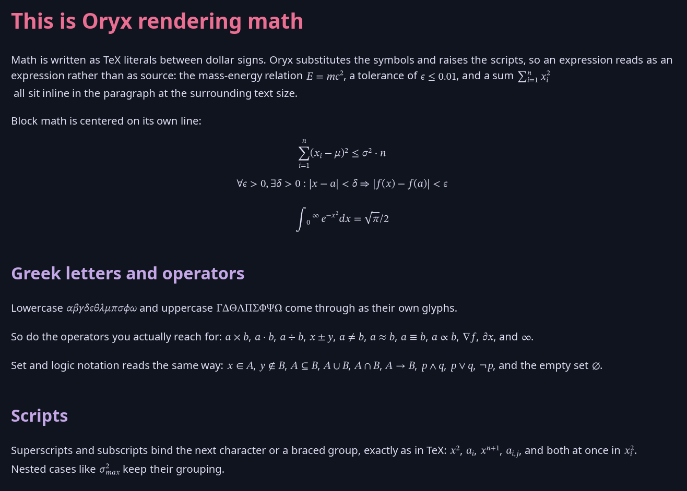
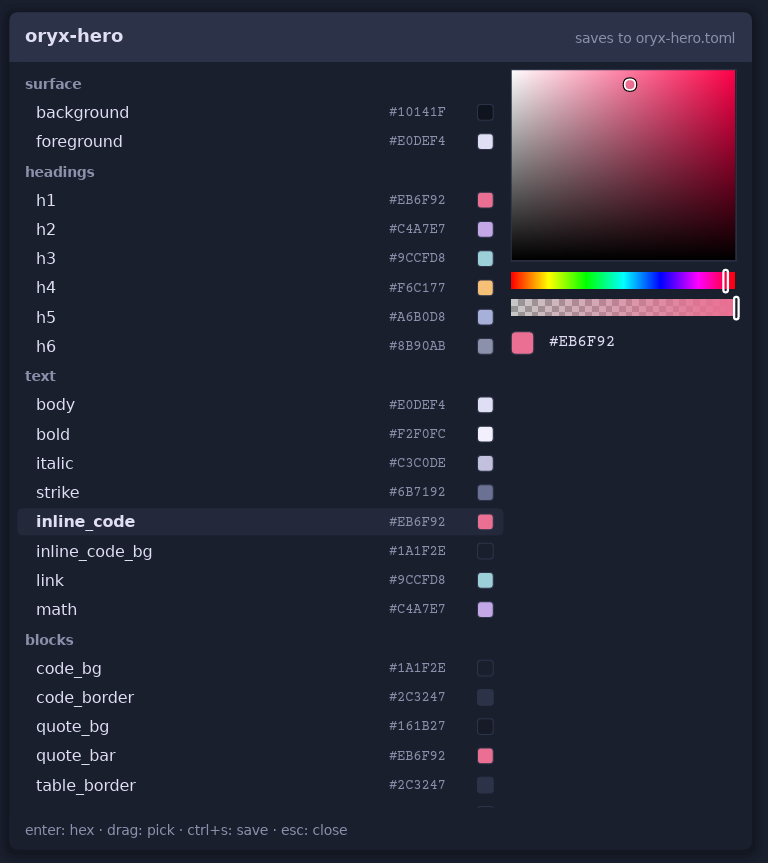

<div align="center">


[What Oryx reads](#what-oryx-reads) •
[Books](#books-epub) •
[Themes](#themes) •
[Export to PDF](#export-to-pdf) •
[Install](#install) •
[Using Oryx](#using-oryx) •
[Performance](#performance)

</div>

Oryx started as a personal project. I work with a lot of markdown files and did not find a (very) fast tool that could render them beautifully on the desktop without the need for a browser. Exporting to PDF would be a plus. That was the first version of the functional specs. Oryx has grown a lot since, and it stayed fast. The latest addition is EPUB: Oryx opens a book like any other document and renders it in the Oryx themes. Editing markdown is a tempting feature, but not on the roadmap at this stage.

- **Instant**: A document is on screen in well under 100 ms from cold, even an 8 MB file.
- **Light**: Memory stays flat as you scroll, whatever the file size.
- **Distraction-free**: No panes, no toolbars, no menus. `F1` lists the shortcuts, `Esc` closes whatever is open.
- **Beautiful**: 31 themes, each defining all 51 color roles, for reading and for PDF export alike.
- **Self-contained**: One binary and a folder of themes. No browser engine, no runtime, no GPU requirement.
- **Runs anywhere**: The same speed on a new laptop or an old machine with no graphics card.

## What Oryx reads

The complete recognized syntax, markdown and embedded HTML, is listed in [SYNTAX.md](SYNTAX.md). The [examples](examples/) folder is installed with Oryx and shows the syntax on real documents.

### Markdown

Headings, bold, italic, strikethrough, inline code, links and bare URLs (a link to another file opens it in Oryx), nested blockquotes, horizontal rules, smart quotes and dashes, and emoji shortcodes like `:tada:` :tada:. Ordered, unordered and task lists nest as deep as needed. A lot of care was given to details: for example, a wrapped line aligns with the text above it, not with the bullet, and tables keep per-column alignment, shade alternating rows and wrap long cells, so a wide table does not run off the page.

### Source code

Fenced blocks get a bordered panel and syntax colors for code, and a line too long for the panel wraps inside it. Oryx also opens source files directly and renders them as one highlighted document. Over a hundred extensions are supported, from Rust and Python to Terraform and Zig. A `Dockerfile` or a `Makefile` is recognized by its name. Any other text file opens in the code font. Binary files are refused.


### GitHub flavor and more

The five GitHub alerts are styled, each with its own color and title. Oryx shows a YAML frontmatter header as a small metadata panel above the document. Footnote markers appear raised in the text and link to their definitions, gathered at the foot of the document.

**Images and badges**: Supported formats are PNG, JPEG, GIF, WebP or SVG. Remote images are fetched in the background and cached on disk, so a README covered in badges comes up immediately the second time it is opened, and keeps working offline. If a path is broken, the image is replaced by a placeholder with the alt text.

**Embedded HTML** covers what GitHub renders: tables with or without a header row, collapsible `<details>` sections, HTML headings, lists and quotes, definition lists, centered blocks, images at a set width or height, rows of clickable badges, and the inline tags down to `mark`, `kbd` and `small`. Search sees into a closed section, and jumping to a match unfolds it.


### Math

Oryx typesets TeX math in the STIX Two Math font: fractions, radicals, matrices, stretched delimiters and stacked limits. It recognizes all four GitHub notations: `$...$`, `$$...$$`, a `math` fence, and the backtick form ``$`...`$``. Oryx infers whether a dollar sign is a currency or a math delimiter, so prices like `$5-$10` stay text.

The command vocabulary is KaTeX compatible: Greek, binary operators, relations and their negations, arrows, accents, the seven math alphabets, operator names, spacing, the matrix environments, and `\newcommand` macros. If Oryx encounters an unknown command, it will render it as its literal source, and the rest of the equation renders normally. An equation wider than the window shrinks to fit (to a reasonable extent). PDF export includes the typeset math, and text copied from the PDF reads back as the equation's characters. The supported commands are listed in [SYNTAX.md](SYNTAX.md#math), and [examples/sample-math.md](examples/sample-math.md) shows many of them in one document.



## Books (EPUB)

Oryx opens EPUB books and renders them as one continuous document, in the active theme rather than the book's own styling. The book keeps its structure: chapter headings, italics and bold (including the ones its stylesheet sets), images and the cover, tables and highlighted code. The first chapters display immediately and the rest of the book loads in the background.

Book text is justified: lines end at the same right edge, and the last line of each paragraph stays ragged, like print. `Ctrl+J` turns justification off and on. Markdown files can justify too; they start ragged, and each kind remembers its own choice.

The sidebar's Outline tab shows the book's own table of contents, follows the reading position and jumps on a click. Links inside the book work, so a footnote reference jumps to its note and back. Unlike markdown files, which open at the top, ebooks reopen where reading stopped.

DRM-protected books and fixed-layout books (usually comics and picture books) are not supported. The [examples](examples/) folder installed with Oryx includes *The Adventures of Sherlock Holmes* to try it on.

## Tools

- **Find in document**: `Ctrl+F` searches text. The search is smart about case: `oryx` matches Oryx, ORYX and oryx, while `Oryx` performs an exact match. A match can cross styling, so `fast viewer` is found even when it was written as `**fast** *viewer*`, and it can cross a wrapped line. The whole document is searchable even while a big file is still loading.
- **Select and copy**: `Ctrl+C` copies a selection as plain text. `Ctrl+Shift+C` copies the original markdown of the selection. A double click selects the word, a triple click the paragraph, the code line or the table cell. Select all is instant at any file size, a selection survives zooming, theme switches and window resizes, and both copies work before a big file has finished loading.
- **Sidebar**: `Ctrl+Shift+B` opens a two-tab panel: the folder tree around the open file, and an outline of the document's headings that tracks the reading position, folds its branches, and jumps on a click. For a book, the outline is its table of contents. Both tabs drive entirely from the keyboard.
- **Open file**: `Ctrl+O` opens the native file dialog.
- **Live reload**: Oryx notices when the open file changes on disk and reloads it, as long as there are no unsaved edits. `F5` / `Ctrl+R` reload on demand.
- **Zoom**: `Ctrl+Plus` (in) and `Ctrl+Minus` (out).
- **Display scale**: Oryx follows the display's scale, so text and controls render at the intended size on a scaled screen (a laptop at 200%, for example). An `interface scale` entry in the settings (`Ctrl+,`) adjusts the size around the detected value, from -50% to +100%, and is remembered.
- **Touch**: On a touch screen, swiping scrolls the document, the sidebar and the dialogs. A swipe released while moving keeps the document scrolling with momentum. Tapping clicks, and a two-finger pinch zooms the document.
- **Persistence**: Window geometry, the active theme, the sidebar and the last folder are all saved and restored at every start.

## Editing

I often notice a typo in a note or want to fix a comment while reading a source file, and switching to an editor for one word feels wrong. Press `Ctrl+E` and the page itself becomes editable, with a caret and the usual keys; `Escape` (or `Ctrl+E` again) returns to reading.

Source code and plain text files can be edited. Markdown files cannot yet (editing a rendered page while it stays a page is the hard part, and it is being worked on), books cannot at all, and neither can a file whose text did not read cleanly, since Oryx could not write it back exactly as it was. A small notice in the corner says so when editing is not available.

Editing works the way a text editor does: typing, selections, `Ctrl+X` and `Ctrl+V`, undo with `Ctrl+Z`, redo with `Ctrl+Shift+Z` or `Ctrl+Y`. While editing, `Ctrl+Left` / `Ctrl+Right` jump by word, `Ctrl+Home` / `Ctrl+End` jump to the ends of the file, and `Ctrl+Backspace` / `Ctrl+Delete` delete by word. Typing is instant even in very large files.

`Ctrl+S` saves. Oryx is careful with the file: lines that were not touched are written back byte for byte, and every line keeps its own ending, so a file with Windows line endings stays that way. The window title shows a `*` while changes are unsaved. `Ctrl+Shift+S` saves under a new name, and `Ctrl+N` creates a new file: the save dialog opens first, then the empty page is ready to type into.

Closing the window, quitting or reloading with unsaved changes asks first: `Enter` saves, `D` discards, `Escape` keeps editing. If the file changes on disk while there are unsaved edits, Oryx shows a notice and leaves the edits alone.

## Themes

Thirty-one themes ship with Oryx. Editable TOML files with **51 color roles**, so every possible markdown element can be colored separately.

Press `Ctrl+T` to open the theme browser. Arrow keys move through the list and preview the selected theme, `Enter` validates and closes the browser, and `Escape` restores the previous one (cancels):

<p align="center">
  
</p>

The theme editor changes any role with a color picker while the document restyles behind it. Editing a bundled theme creates a copy, so the shipped files remain as they were. A custom theme is a TOML file saved in the themes directory.

<p align="center">
  
</p>

Nine themes are original designs: `oryx-light` and its dark twin `oryx-dark`, `oryx-sand` and `oryx-night`, `inkstone`, `ember`, `meadow`, `slate`, and `be-vendible`. The rest adapt permissively licensed editor palettes, [credited below](#credits).

## Export to PDF

`Ctrl+Shift+P` opens the export settings: theme, body font and size, code font and size, page size, orientation and page numbers. Six page sizes are available: A4, Letter and Legal, and the book trim sizes A5, 6 x 9 in and 5 x 8 in, so a book can export at its print size. When the document is a book, a justify toggle is also present. The export settings are kept separate from the app's own appearance and remembered between runs. The idea is that reading in a dark theme at 22 points and exporting in a light one at 11 should not need switching back and forth each time we need an export.

`Ctrl+P` exports the document using the configured export settings. Markdown headings are converted to PDF outlines, and the fonts are embedded. Emoji render in the PDF as images. A book exports with each chapter starting on a new page, and its table of contents becomes the PDF outline.

**Oryx tries its best so that**:

- Page breaks don't happen through a line
- Headings are not left alone at the foot of a page
- Images are not cut
- Table rows are not split between pages unless the row is taller than the page itself

## Install

### From a release

Download the archive for your platform from the releases page on [Codeberg](https://codeberg.org/wmahfoudh/oryx/releases) or [GitHub](https://github.com/wmahfoudh/oryx/releases), extract it, and run the installer inside:

```sh
tar -xzf oryx-*-linux-x86_64.tar.gz && cd oryx && ./install.sh
```

On Windows, extract the zip and run `install.ps1` in PowerShell. The installer copies the binary, the themes and the example documents, and registers the file association, so markdown files and EPUB books open with Oryx from the file manager. `./install.sh --uninstall` removes everything.

### From source

Building requires **Rust 1.80 or later**.

```sh
git clone https://codeberg.org/wmahfoudh/oryx.git   # or https://github.com/wmahfoudh/oryx.git
cd oryx
make install
```

`make install` builds the release binary, installs it to `~/.local/bin`, copies the themes and examples to `~/.local/share/oryx` and registers the file association. Plain `cargo build --release` works too; the binary looks for `themes/` next to itself, in the XDG data directory, and in the working directory.

> [!TIP]
> Use a release build for everyday reading, because a debug build is noticeably slower on code-heavy documents.

## Using Oryx

After installing, open Oryx from the launcher and browse folders and files through the sidebar.

> [!NOTE]
> There are no menus. **Press `F1`** for the complete shortcut list, `Esc` to close a panel or quit.

```sh
oryx README.md          # open a file
oryx book.epub          # books read in the active theme
oryx src/main.rs        # code files render highlighted
oryx --theme nord file  # pick a theme for this session
oryx --register         # install the file association and icons
oryx --version          # print the version
```

| Shortcut | Action |
|---|---|
| **Files** | |
| `Ctrl+O` | Open a file |
| `Ctrl+N` | New file |
| `Ctrl+S` | Save (editing) |
| `Ctrl+Shift+S` | Save as (editing) |
| `F5` / `Ctrl+R` | Reload from disk |
| **Navigation** | |
| `Up` / `Down` | Scroll by line, or move the sidebar selection |
| `Page Up` / `Page Down`, `Space` / `Shift+Space` | Scroll by page |
| `Home` / `End` | Jump to top / bottom |
| `Ctrl+Shift+B` | Toggle sidebar (files and outline) |
| `Left` / `Right` | Toggle between sidebar and document |
| `Ctrl+Tab` | Toggle the sidebar tab |
| **Find** | |
| `Ctrl+F` | Find in document |
| `F3` / `Shift+F3` | Next / previous match |
| **Selection** | |
| `Ctrl+A` | Select all |
| `Ctrl+C` | Copy selection as text |
| `Ctrl+Shift+C` | Copy selection as markdown |
| **Edit** | |
| `Ctrl+E` | Edit the document |
| `Ctrl+X` / `Ctrl+V` | Cut / paste (editing) |
| `Ctrl+Z` | Undo the last edit |
| `Ctrl+Shift+Z` / `Ctrl+Y` | Redo an undone edit |
| **View** | |
| `Ctrl+T` | Choose a theme |
| `Ctrl+,` | Change fonts and sizes |
| `Ctrl+Plus` / `Ctrl+Minus` | Zoom in / out |
| `Ctrl+0` | Reset zoom |
| `Ctrl+J` | Justify prose (markdown and books) |
| **Export** | |
| `Ctrl+P` | Export to PDF |
| `Ctrl+Shift+P` | Choose export settings, then export |
| **Help** | |
| `F1` | Show the shortcuts help |
| `Escape` | Close overlay or sidebar, leave editing, quit |

`Ctrl` is `Cmd` on macOS.

## Performance

Performance is one of the reasons Oryx was created. Most markdown viewers start struggling above one megabyte of file size, without even offering decent theming. Oryx was built to remove that ceiling: the same reading, whatever the file size and whatever the machine. Here is how it works:

For a big markdown file, Oryx parses only its first screens before the first paint and the rest arrives from a background thread. It uses all CPU cores to build the layout, for the wash-in below the first screens as well as every zoom or resize. Only the part of the document around the reading position is kept in drawn form, and scrolling rebuilds the landing from recorded positions in about a millisecond; memory stays flat however long the document is. Painting covers a band around the viewport, a couple of screens either side, and scrolling inside that band is a memory copy: the cost of a scroll frame does not depend on the document's length. Syntax highlighting and the layout below follow in the background, a slice at a time, without moving anything already on screen.

A PDF export streams pages to disk as they are laid out, and even a five-thousand-page export runs in a few megabytes of working memory. A book opens the same way: the first chapters parse before the first paint, and the rest of the book arrives in the background, images included. The event loop wakes only for input, and an idle window uses **no CPU at all**.

Measured on a 2019 Linux laptop, release build. First frame is cold launch to first paint; the export column is the export itself, measured after syntax highlighting has settled:

| Document | First frame | PDF export |
|---|---|---|
| 1 MB source file | **80 ms** | 1.3 s |
| 8 MB source file | **85 ms** | 10.2 s |
| 1 MB markdown | **80 ms** | 1.2 s |
| 8 MB markdown | **80 ms** | 10.7 s |

The 8 MB markdown export writes a 9219-page file. While open, the 8 MB markdown file reads in about 200 MB of memory and the 8 MB source file in about 90 MB. The sample book, *The Adventures of Sherlock Holmes*, parses its first chapters in 9 ms and exports its 211 pages in 0.8 s. Performance tests in the repository check the startup, relayout, paint and export timings and the memory figures.

> [!NOTE]
> Oryx is not a markdown-to-PDF converter. Its export reproduces the page you read, pixel for pixel: the theme, every shaped glyph, syntax colors for close to a hundred languages, images, links, the outline and the embedded fonts, at a millisecond or two per finished page whatever the document size. Raw conversion without any of that is a different, far faster job: a few milliseconds for a whole small file.

## Limits

Oryx is built for everyday use, and some things are out of scope (for the moment):

- It does not edit files.
- On a file several megabytes long, the colors and the layout below the first screens take a moment to catch up. An export waits for syntax highlighting to finish before it writes, so on the 8 MB file the wall time is roughly double the export column.
- The implemented HTML is a subset: what GitHub renders in a README, nothing more.
- Remote images use the operating system's TLS stack, which on Linux means it needs the OpenSSL library (normally shipped with every distro). Without it, badges show placeholders but everything else works.
- macOS compiles but is untested, and there is no packaged build as I don't have a Mac. The Windows release is compiled on my Linux machine.

## Credits

DejaVu Sans, Courier Prime and STIX Two Math are embedded in the binary. DejaVu is distributed under the DejaVu Fonts License, Courier Prime and STIX Two Math under the SIL Open Font License. STIX renders the math and stays out of the font picker. The settings dialog can switch the text fonts to any family installed on the system.

The sample book in [examples](examples/) is the [Standard Ebooks](https://standardebooks.org) edition of *The Adventures of Sherlock Holmes*, in the public domain and dedicated with CC0 by its producers.

<details>
<summary><b>Adapted theme palettes</b> (all MIT, with thanks to their authors)</summary>

- Dracula ([draculatheme.com](https://draculatheme.com))
- Nord ([nordtheme.com](https://www.nordtheme.com))
- Gruvbox dark and light ([morhetz/gruvbox](https://github.com/morhetz/gruvbox))
- Catppuccin Mocha and Latte ([catppuccin.com](https://catppuccin.com))
- Tokyo Night ([enkia/tokyo-night-vscode-theme](https://github.com/enkia/tokyo-night-vscode-theme))
- Solarized dark and light by Ethan Schoonover ([ethanschoonover.com/solarized](https://ethanschoonover.com/solarized))
- One Dark ([atom](https://github.com/atom/atom))
- Everforest dark and light ([sainnhe/everforest](https://github.com/sainnhe/everforest))
- Rosé Pine and Rosé Pine Dawn ([rosepinetheme.com](https://rosepinetheme.com))
- Kanagawa ([rebelot/kanagawa.nvim](https://github.com/rebelot/kanagawa.nvim))
- Ayu Mirage and Light ([ayu-theme](https://github.com/ayu-theme/ayu-colors))
- Night Owl by Sarah Drasner ([sdras/night-owl-vscode-theme](https://github.com/sdras/night-owl-vscode-theme))
- Horizon ([jolaleye/horizon-theme-vscode](https://github.com/jolaleye/horizon-theme-vscode))
- Flexoki dark and light by Steph Ango ([stephango.com/flexoki](https://stephango.com/flexoki))
- GitHub Light ([primer/primitives](https://github.com/primer/primitives))
    
</details>

<details>
<summary><b>Bundled grammars</b> (beyond syntect's defaults, with thanks to their authors)</summary>

- TOML ([sublimehq/Packages](https://github.com/sublimehq/Packages))
- INI ([jwortmann/ini-syntax](https://github.com/jwortmann/ini-syntax), MIT)
- Kotlin ([guille/sublime-kotlin](https://github.com/guille/sublime-kotlin), public domain)
- Swift ([aerobounce/Swift-Next](https://github.com/aerobounce/Swift-Next), MIT)
- TypeScript and TSX, Microsoft's grammars (Apache-2.0) as converted by [bat](https://github.com/sharkdp/bat)
- Dockerfile ([keith-hall/Containerfile-sublime-syntax](https://github.com/keith-hall/Containerfile-sublime-syntax), MIT)
- Zig ([ziglang/sublime-zig-language](https://github.com/ziglang/sublime-zig-language), MIT)
- Terraform and HCL ([alexlouden/Terraform.tmLanguage](https://github.com/alexlouden/Terraform.tmLanguage), MIT)
- GraphQL ([dncrews/GraphQL-SublimeText3](https://github.com/dncrews/GraphQL-SublimeText3), MIT)
- Protocol Buffers ([VcamX/protobuf-syntax-highlighting](https://github.com/VcamX/protobuf-syntax-highlighting), MIT)

Each grammar ships with its license text beside the source under `assets/syntaxes/`.

</details>

<div align="center">

Oryx is free software, released under the [GNU General Public License v3.0](LICENSE).

</div>
